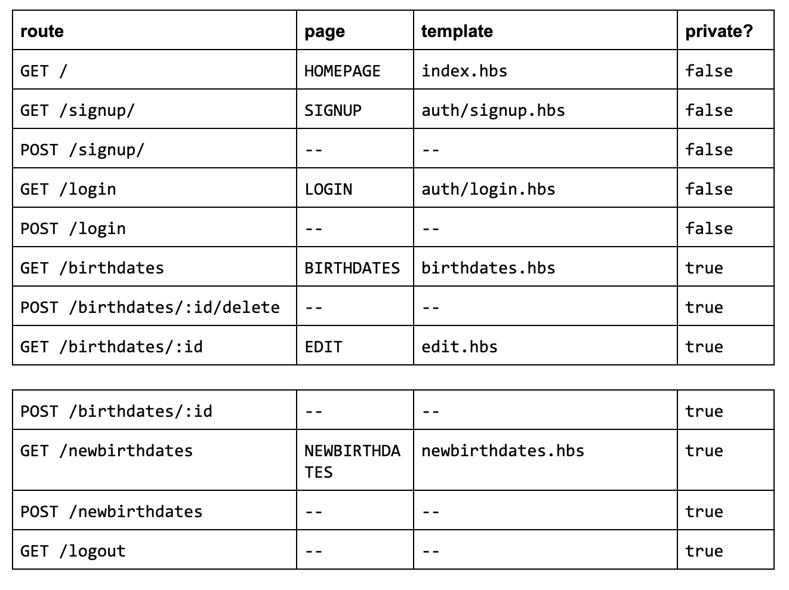

# Project #2 : Birthdates

<h1>Birthdates</h1>

Il s'agit d'une application qui permet d'envoyer automatiquement des mails d'anniversaires a nos proches. 
Une fois le compte créé et les informations ajoutées, un email sera envoyé automatiquement à la personne concernée le jour de son anniversaire.

Voici le lien de Birthdates : https://birthdatestracymarina.herokuapp.com/

<h2>ERD</h2>

Voici le diagramme entité-relation de Birthdates :

 

<h2>Les routes</h2>

Voici les différentes routes de Birthdates :

 

<h2>Langages web utilisés</h2>
- Frontend Technologies :
  HTML
  Javascript
  CSS

 - Backend Technologies :
   Nodejs

